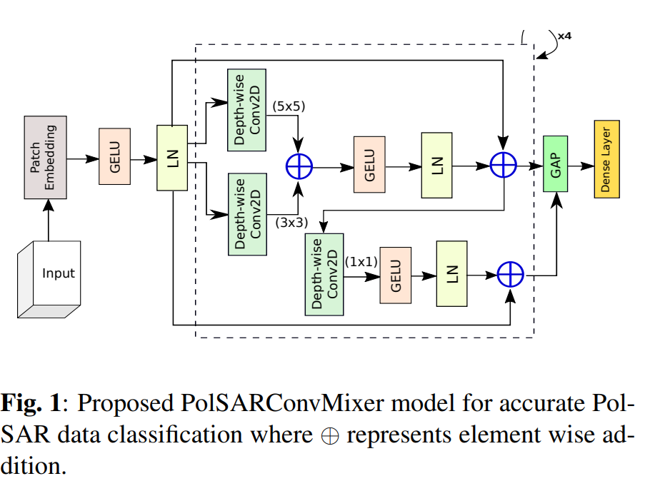

# POLSARCONVMIXER: A CHANNEL AND SPATIAL MIXING CONVOLUTIONAL ALGORITHM FOR POLSAR DATA CLASSIFICATION

[Ali Jamali](https://www.researchgate.net/profile/Ali-Jamali), [Swalpa Kumar Roy](https://swalpa.github.io), [Bing Lu](https://www.sfu.ca/people/binglu/about.html), [Avik Bhattacharya](http://www.mrslab.in/Avik/), and [Pedram Ghamisi](https://www.iarai.ac.at/people/pedramghamisi/)

___________

This Keras code is for the paper Jamali, A., Roy, S. K., Lu, B., Bhattacharya, A., & Ghamisi, P. (2024, July). PolSARConvMixer: A Channel and Spatial Mixing Convolutional Algorithm for PolSAR Data Classification. In IGARSS 2024-2024 IEEE International Geoscience and Remote Sensing Symposium (pp. 11248-11251). IEEE. [https://ieeexplore.ieee.org/abstract/document/10642190].

---------------------
### Dataset

Flevoland dataset: NASA/JPL AIRSAR recorded the data of Flevoland, situated in the Netherlands, on August 16, 1989. 
The Flevoland image is $750\times1024$ pixels in size.

San Francisco dataset: The San Francisco illustrates a NASA/JPL AIRSAR L-band image of the San Francisco area. 
The resolution of the data of the San Francisco is $900\times1024$ pixels.

Citation
---------------------

**Please kindly cite the papers if this code is useful and helpful for your research.**

@INPROCEEDINGS{10642190,
  author={Jamali, Ali and Roy, Swalpa Kumar and Lu, Bing and Bhattacharya, Avik and Ghamisi, Pedram},
  booktitle={IGARSS 2024 - 2024 IEEE International Geoscience and Remote Sensing Symposium}, 
  title={PolSARConvMixer: A Channel and Spatial Mixing Convolutional Algorithm for PolSAR Data Classification}, 
  year={2024},
  volume={},
  number={},
  pages={11248-11251},
  doi={10.1109/IGARSS53475.2024.10642190}
  }

## License

Copyright (c) 2023 Ali Jamali. Released under the MIT License. See [LICENSE](LICENSE) for details.
